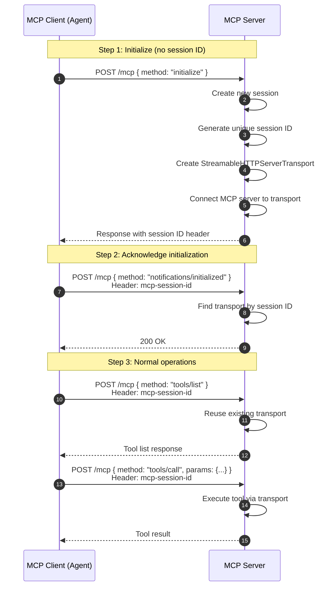

# Why Sessions Are Required for MCP Servers

## Overview

Sessions are a **fundamental requirement** of the Model Context Protocol (MCP) Streamable HTTP architecture, not an optional feature. This document explains the architectural, protocol, and practical reasons why MCP servers cannot function without session management.

---

## Table of Contents

1. [The Core Problem: HTTP is Stateless](#the-core-problem-http-is-stateless)
2. [MCP Protocol Requirements](#mcp-protocol-requirements)
3. [Session Lifecycle](#session-lifecycle)
4. [Technical Implementation Details](#technical-implementation-details)
5. [What Would Break Without Sessions](#what-would-break-without-sessions)
6. [Multi-Agent Concurrent Access](#multi-agent-concurrent-access)
7. [Related Documentation](#related-documentation)

---

## The Core Problem: HTTP is Stateless

HTTP, by design, is a **stateless protocol**. Each request is independent and contains no inherent knowledge of previous requests. However, MCP requires:

- **Stateful bidirectional communication** between clients and servers
- **Context persistence** across multiple tool calls
- **Streaming responses** that span multiple HTTP requests
- **Server capability negotiation** that happens once per connection

Sessions bridge the gap between HTTP's stateless nature and MCP's stateful requirements.

### Without Sessions
```
Request 1: Client → Server (initialize)
Request 2: Client → Server (tools/list)
         ❌ Server has no memory of Request 1
         ❌ Server doesn't know client is initialized
         ❌ HTTP 400: "Server not initialized"
```

### With Sessions
```
Request 1: Client → Server (initialize)
          → Server creates session abc123
          → Server stores transport in memory
Request 2: Client → Server (tools/list, sessionId: abc123)
          ✅ Server finds transport for abc123
          ✅ Reuses initialized connection
          ✅ Returns tool list successfully
```

---

## MCP Protocol Requirements

The MCP Streamable HTTP specification mandates a specific initialization handshake:

### Required Protocol Flow



### Protocol Violations This Project Previously Had

As documented in `docs/session-management-fix.md`, this codebase initially violated the MCP protocol:

**❌ The Problem:**
```typescript
// Client incorrectly pre-generated session IDs
const mcpServer = new MCPServerStreamableHttp({
  url: 'http://localhost:3000/mcp',
  sessionId: `agent-${Date.now()}-${Math.random()}`, // ❌ Client controls ID
});

// Client skipped initialization
// First request: tools/list instead of initialize
// Result: HTTP 400 "Server not initialized"
```

**✅ The Fix:**
```typescript
// Let server assign session ID during initialization
const mcpServer = new MCPServerStreamableHttp({
  url: 'http://localhost:3000/mcp',
  // No sessionId parameter
});

// Client sends initialize as first request
// Server creates session and returns ID
// Client uses that ID for all subsequent requests
```

---

## Session Lifecycle

### Creation Phase

When a client connects for the first time:

```typescript
// src/index.ts (lines 102-127)
if (!sessionId) {
  console.log("Initializing new session");
  const newSessionId = randomUUID();
  
  // Create dedicated transport for this session
  transport = new StreamableHTTPServerTransport({
    sessionIdGenerator: () => newSessionId,
  });

  // CRITICAL: Store transport BEFORE handling initialize request
  transports[newSessionId] = transport;
  console.log(`Session pre-stored: ${newSessionId}`);

  // Set up cleanup handler
  transport.onclose = async () => {
    if (transport.sessionId) {
      delete transports[transport.sessionId];
      console.log(`Session closed: ${transport.sessionId}`);
    }
  };

  // Connect MCP server to this transport
  const { server } = createServer();
  await server.connect(transport);
}
```

**Key Implementation Detail:** The transport must be stored in the `transports` registry **before** handling the initialize request. This ensures that the `notifications/initialized` message (sent immediately after `initialize`) can find the transport.

### Active Phase

During normal operation:

```typescript
// src/index.ts (lines 98-101)
if (sessionId && transports[sessionId]) {
  console.log(`Reusing session: ${sessionId}`);
  transport = transports[sessionId];
}
```

Each request with a valid `mcp-session-id` header:
1. Looks up the transport in the registry
2. Reuses the existing transport instance
3. Maintains all session state and context

### Cleanup Phase

Sessions are terminated when:

**1. Client explicitly closes the session:**
```typescript
// src/index.ts (lines 197-212)
app.delete("/mcp", async (req: Request, res: Response) => {
  const sessionId = req.headers["mcp-session-id"] as string;
  const transport = transports[sessionId];

  if (transport) {
    await transport.handleRequest(req, res);
    // Transport's onclose handler will remove it from registry
  }
});
```

**2. Server shutdown:**
```typescript
// src/index.ts (lines 217-227)
process.on("SIGINT", async () => {
  console.log("\nShutting down gracefully...");
  
  // Close all active sessions
  await Promise.all(
    Object.values(transports).map((transport) => transport.close())
  );
  
  process.exit(0);
});
```

---

## Technical Implementation Details

### Transport Registry

The server maintains an in-memory registry of active transports:

```typescript
// src/index.ts (lines 70-78)
/**
 * In-memory session registry for active Streamable MCP transports.
 *
 * Key: `mcp-session-id` header value provided by the client.
 * Value: A `StreamableHTTPServerTransport` that multiplexes streaming chunks
 *        across HTTP requests for that session.
 */
const transports: Record<string, StreamableHTTPServerTransport> = {};
```

### Why Each Session Needs Its Own Transport

A `StreamableHTTPServerTransport` instance maintains:

1. **Message Queue:** Buffers streaming response chunks
2. **Connection State:** Tracks initialization, capabilities, protocol version
3. **Session ID:** Unique identifier for this client connection
4. **Event Handlers:** `onclose`, error handlers, etc.
5. **MCP Server Binding:** Connected instance of the MCP server

**Sharing a single transport across clients would cause:**
- Message queue corruption (Client A sees Client B's responses)
- State conflicts (one client's initialization affects another)
- Race conditions (concurrent tool calls interfere)
- Resource leaks (no way to cleanup individual connections)

### HTTP Method Routing

Sessions enable proper routing across HTTP methods:

**POST `/mcp`** - JSON-RPC requests
```typescript
// Initialize new session OR handle existing session request
const sessionId = req.headers["mcp-session-id"];
const transport = sessionId ? transports[sessionId] : createNewSession();
await transport.handleRequest(req, res, req.body);
```

**GET `/mcp`** - Stream response chunks
```typescript
// REQUIRES session ID to know which stream to read
const sessionId = req.headers["mcp-session-id"];
const transport = transports[sessionId];
await transport.handleRequest(req, res);
```

**DELETE `/mcp`** - Cleanup
```typescript
// REQUIRES session ID to know which session to close
const sessionId = req.headers["mcp-session-id"];
const transport = transports[sessionId];
await transport.handleRequest(req, res);
```

Without sessions, the server cannot route GET/DELETE requests to the correct transport.

---

## What Would Break Without Sessions

### Scenario 1: Single Agent Connection

**Without Sessions:**
```
1. Client sends initialize
2. Server creates transport, responds
3. Client sends tools/list
4. ❌ Server has no way to find the transport created in step 2
5. ❌ Server error: "Transport not found"
```

**With Sessions:**
```
1. Client sends initialize (no session ID)
2. Server creates transport, assigns session ID "abc123"
3. Client sends tools/list (session ID: abc123)
4. ✅ Server finds transport for session abc123
5. ✅ Returns tool list successfully
```

### Scenario 2: Multiple Concurrent Agents

**Without Sessions:**
```
Agent A: initialize
Server: creates transport T1

Agent B: initialize
Server: creates transport T2, overwrites T1 reference

Agent A: tools/call
Server: uses T2 (wrong transport!)
❌ Agent A gets Agent B's context or errors
```

**With Sessions:**
```
Agent A: initialize → session: abc123 → transport T1
Agent B: initialize → session: xyz789 → transport T2

Agent A: tools/call (session: abc123)
Server: routes to T1 ✅

Agent B: tools/call (session: xyz789)
Server: routes to T2 ✅

Both agents work independently without interference
```

### Scenario 3: Streaming Responses

**Without Sessions:**
```
Client: POST /mcp { tools/call } → triggers streaming response
Server: starts streaming to... which transport?
Client: GET /mcp → wants to read stream chunks
Server: ❌ has no way to route GET request to correct stream
```

**With Sessions:**
```
Client: POST /mcp { tools/call } (session: abc123)
Server: routes to transport abc123, starts streaming

Client: GET /mcp (session: abc123)
Server: finds transport abc123
Server: reads buffered chunks from that specific transport's queue ✅
```

---

## Multi-Agent Concurrent Access

Sessions are critical for supporting multiple agents simultaneously, as demonstrated in `scripts/multi-agent.mjs`:

### Concurrent Session Isolation

```javascript
// Agent A
const mcpServerA = new MCPServerStreamableHttp({
  url: 'http://localhost:3000/mcp',
  name: 'Weather MCP Server A',
});
await mcpServerA.connect(); // Gets session ID: abc123

// Agent B (running in parallel)
const mcpServerB = new MCPServerStreamableHttp({
  url: 'http://localhost:3000/mcp',
  name: 'Weather MCP Server B',
});
await mcpServerB.connect(); // Gets session ID: xyz789
```

### Server-Side Session Registry

```typescript
transports = {
  'abc123': StreamableHTTPServerTransport { /* Agent A's state */ },
  'xyz789': StreamableHTTPServerTransport { /* Agent B's state */ },
}
```

### Independent Tool Execution

```
Time: 0ms
Agent A: POST /mcp { tools/call: get-alerts, state: "CA" } (session: abc123)
Agent B: POST /mcp { tools/call: get-forecast, lat: 40.7, lon: -74.0 } (session: xyz789)

Time: 50ms
Server: Executes both tool calls in parallel using separate transports
  - Transport abc123 → NWS API call for CA alerts
  - Transport xyz789 → NWS API call for forecast

Time: 200ms
Agent A: receives CA alerts ✅
Agent B: receives NY forecast ✅
```

**Without sessions, this concurrent execution would be impossible.** The server would have no way to:
- Track which agent made which request
- Route responses back to the correct agent
- Prevent state from one agent affecting another

---

## Related Documentation

For deeper understanding of session management in this codebase:

- **`docs/session-management-fix.md`** - Details the bug that occurred when sessions weren't properly implemented and how it was fixed
- **`docs/session-diagrams.md`** - Visual sequence diagrams showing session flow
- **`docs/session-persistence-on-vercel.md`** - Explains challenges with sessions in serverless environments
- **`docs/vercel-kv-session-implementation.md`** - Solution for persisting sessions across serverless function invocations
- **`src/index.ts`** - Server implementation with session management (lines 70-227)
- **`scripts/agent.mjs`** - Example single-agent client
- **`scripts/multi-agent.mjs`** - Example multi-agent concurrent usage

---

## Summary

Sessions are required for MCP Streamable HTTP servers because:

1. **Protocol Compliance:** MCP specification mandates session-based initialization
2. **State Management:** HTTP is stateless; sessions provide statefulness
3. **Transport Isolation:** Each client needs its own transport instance
4. **Concurrent Access:** Multiple agents must operate independently
5. **Resource Management:** Sessions enable proper lifecycle and cleanup
6. **Routing:** GET/DELETE requests require session IDs to find correct transport
7. **Streaming:** Response chunks must be routed to the correct client's queue

**Bottom Line:** Without sessions, the MCP server cannot distinguish between clients, maintain state across requests, or support concurrent connections. Sessions are not an optimization—they are a fundamental architectural requirement.
