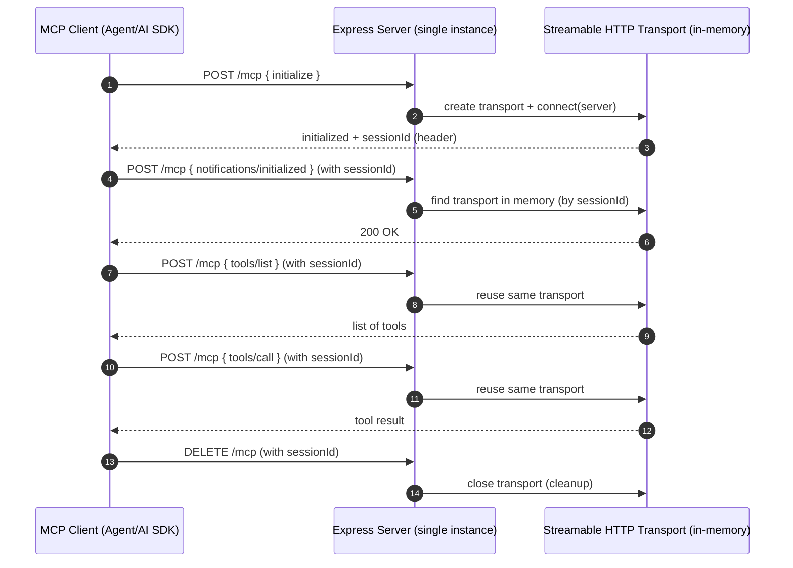
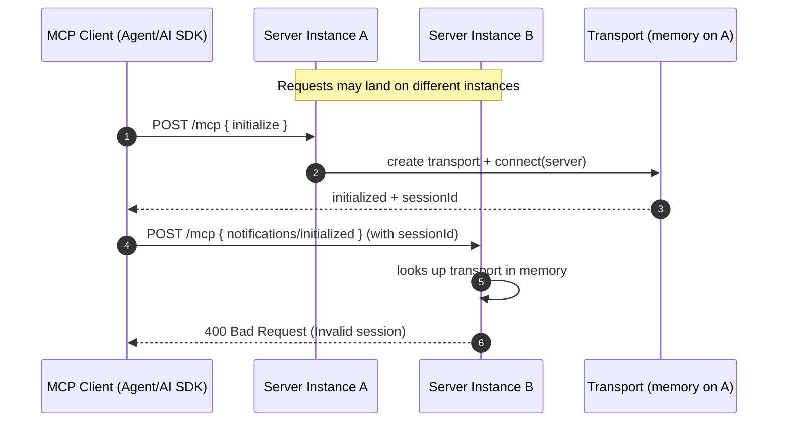
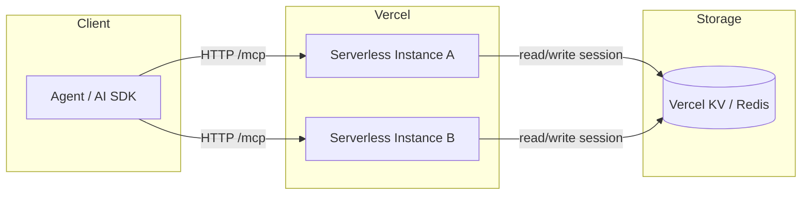
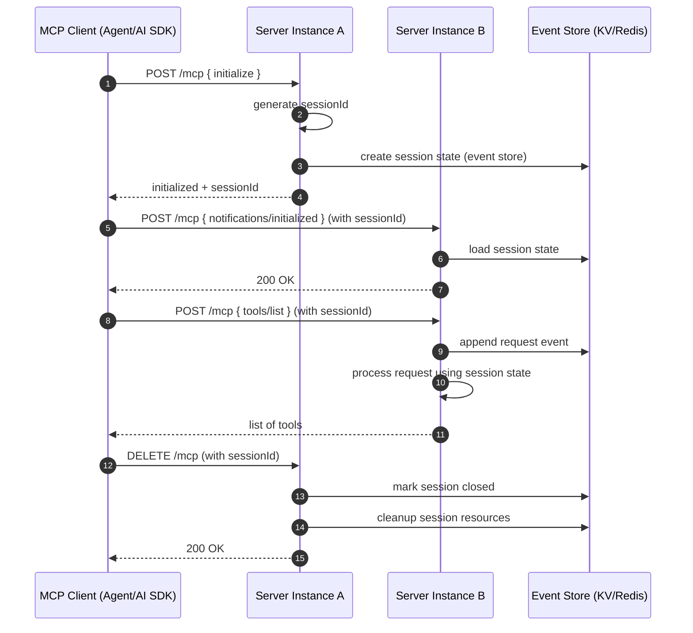
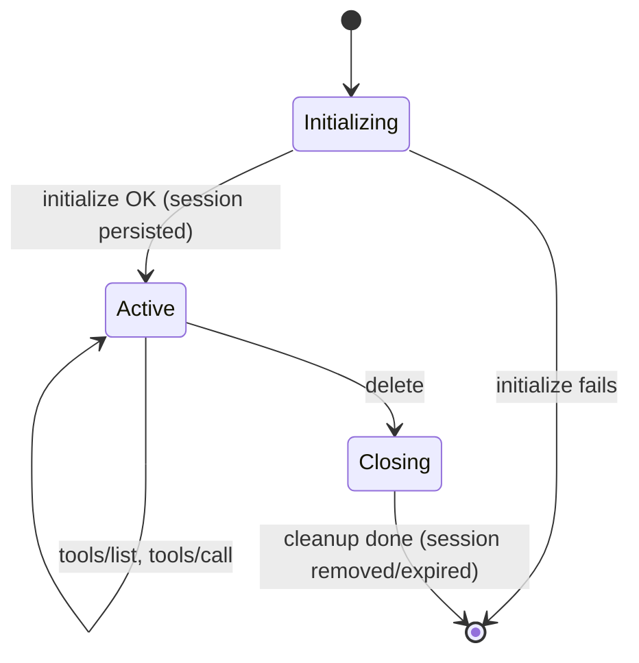
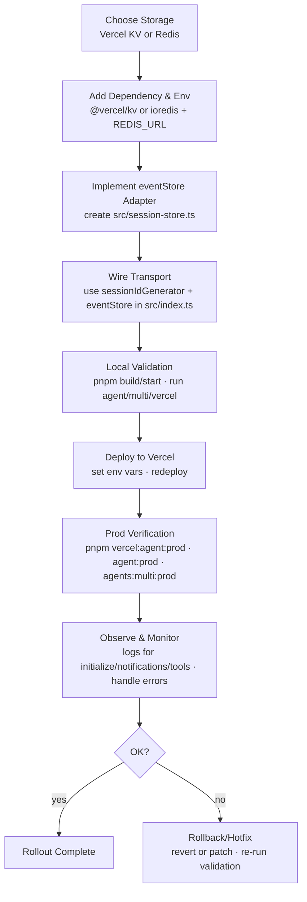

# MCP Streamable HTTP Sessions: Visual Guide

This document complements `docs/session-persistence-on-vercel.md` with visual diagrams that explain the session problem, the production failure mode on Vercel, and the recommended solution using a persistent event store.

---

## 1) Sequence: Localhost (single process) — Works



---

## 2) Sequence: Vercel (serverless, multi-instance) — Fails without persistence



---

## 3) Architecture: With Persistent Event Store — Recommended



---

## 4) Sequence: Vercel with Persistent Event Store — Works



---

## 5) State Diagram: Session Lifecycle (Serverless-safe)



---

## 6) Migration Workflow (from in-memory to persistent)



---

## 7) Key Implementation Points

- **Server assigns session IDs** on initialize; clients must not pre-generate them.
- **Persistent `eventStore`** is required for serverless: either Vercel KV or Redis.
- **Transport wiring**: `new StreamableHTTPServerTransport({ sessionIdGenerator: () => randomUUID(), eventStore })`.
- **Do not rely on in-memory session maps** in serverless production; they are instance-local and ephemeral.

---

## 8) Pointers to Code

- Server entry: `src/index.ts`
- Weather MCP tools: `src/create-server.ts`
- Local agent scripts:
  - Single: `scripts/agent.mjs`
  - Multi: `scripts/multi-agent.mjs`
  - Vercel AI SDK: `scripts/vercel-ai-agent.mjs`
- Reference docs:
  - `docs/session-management-fix.md`
  - `docs/session-persistence-on-vercel.md`
```
